# TransferMe — Jetpack Compose App

A Jetpack Compose Android app built to demonstrate pixel-accurate UI, animations, and modern app architecture. The UI is based on a Figma design and the project focuses on clean Compose patterns, navigation, theming and interaction handling.

## Highlights

- Design source: Figma (frames and specs used to reproduce visual layout and spacing)
- Tech: Kotlin, Jetpack Compose, AndroidX Navigation for Compose
- Single-activity, Compose-first architecture
- Bottom navigation with selectable state and optional hide-on-scroll behavior
- Locale-aware number formatting (system default locale) with thousands grouping
- Transparent navigation gestures area (system navigation bar gestures color settable to transparent)
- Centralized route observation to react to navigation changes

## Project structure (high level)

- app/src/main/java/com/cequea/transferme/
  - ui/navigation/ — navigation host, AppScreens, NavigationViewModel
  - ui/components/ — shared composables (BottomBar, BottomBarItem, etc.)
  - ui/screens/ — feature screens (Home, Wallet, Chart, Profile, etc.)
  - MainActivity.kt — activity entrypoint and window/insets handling
- app/src/main/res/ — resources (drawables, layouts, values)

Key files to inspect right away:
- ui/navigation/AppNavigation.kt — NavHost setup and centralized coordination (route detection, bottom bar visibility)
- ui/navigation/NavigationViewModel.kt — shared ViewModel used to show/hide UI chrome (bottom bar) and other global state
- ui/navigation/AppScreens.kt — sealed class describing screens (immutable; do not modify if used across serialization in your app)
- ui/components/BottomBar.kt — bottom navigation composable, handles isSelected states and animations

## Running the app

1. Open this project in Android Studio (Arctic Fox or newer recommended)
2. Build and run on a device or emulator
   - From terminal: ./gradlew assembleDebug
   - Or use the Run action in Android Studio

## Preview

Below are the screenshots and design images included in the repository (from the images/ folder). The gallery groups login screens together and shows the rest of the screens in a separate section. Thumbnails are width-limited for consistent preview.

### Login screens

<table>
  <tr>
    <td align="center">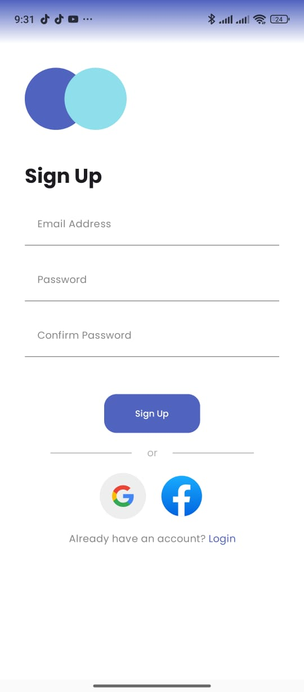 Login — variant 1</td>
    <td align="center">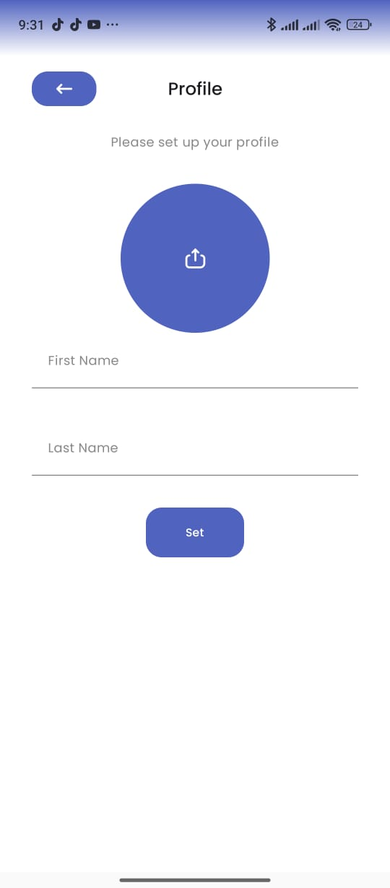 Login — variant 2</td>
    <td align="center">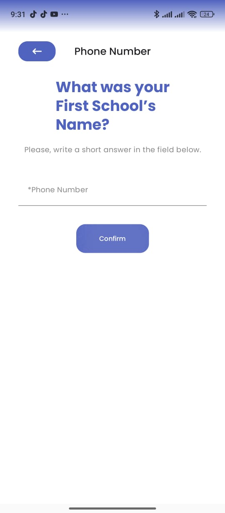 Login — variant 3</td>
    <td align="center">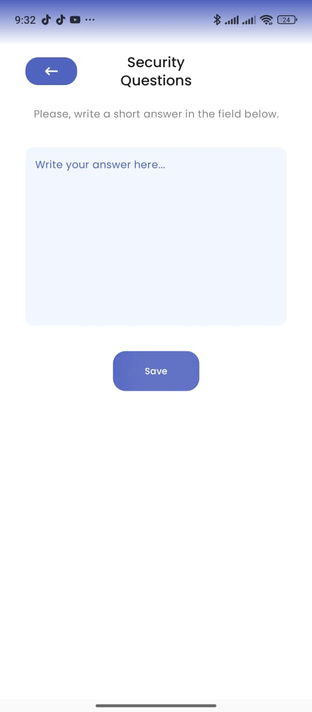 Login — variant 4</td>
    <td align="center">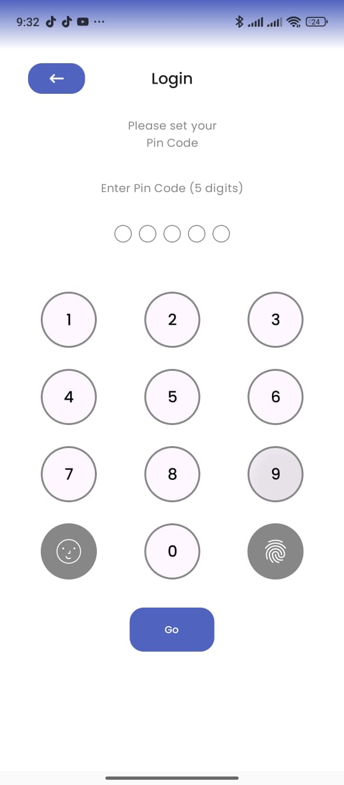 Login — variant 5</td>
  </tr>
</table>

### Other screens

<table>
  <tr>
    <td align="center">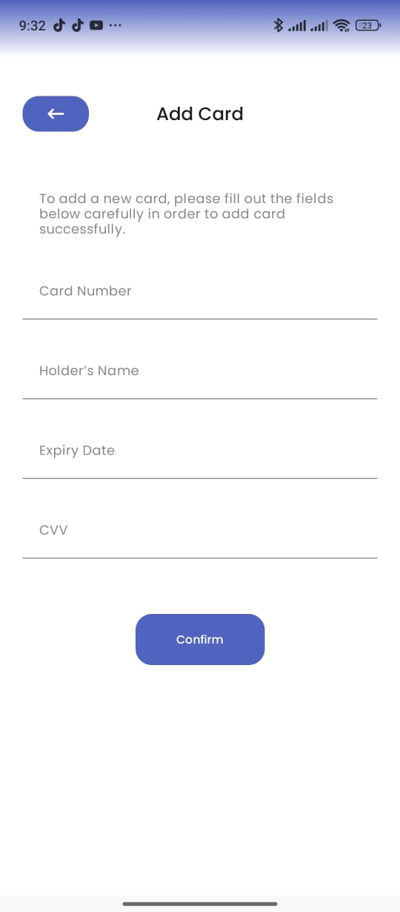 Add card — step 1</td>
    <td align="center">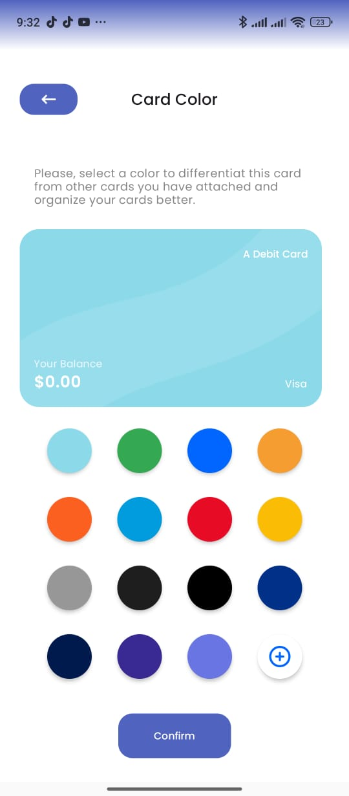 Add card — step 2</td>
    <td align="center">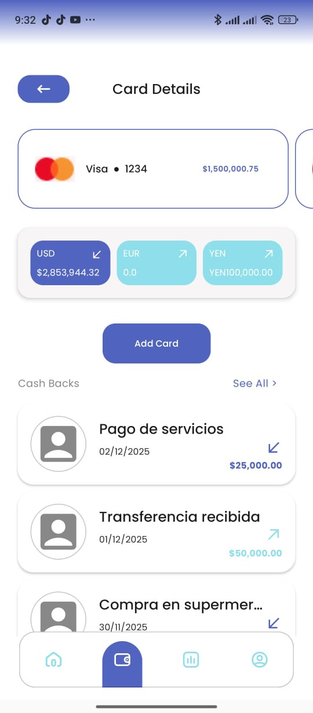 Card details</td>
    <td align="center">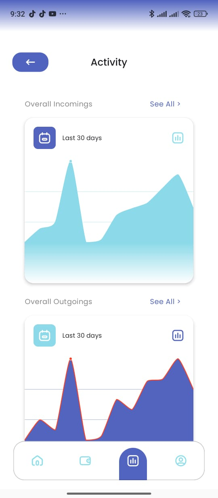 Charts overview</td>
  </tr>
  <tr>
    <td align="center">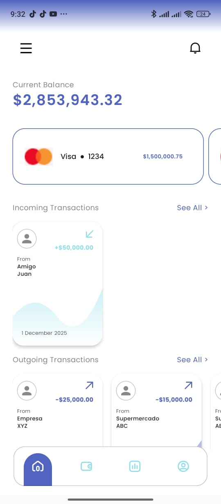 Home screen</td>
    <td align="center">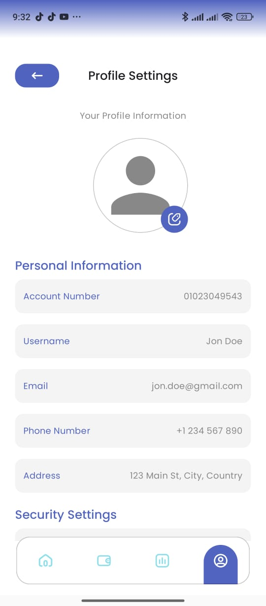 Profile screen</td>
    <td align="center">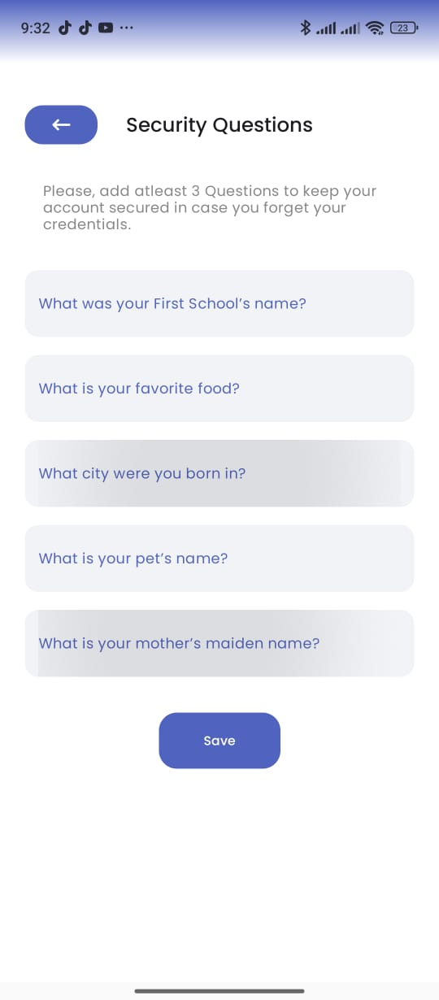 Security questions — step 1</td>
    <td align="center">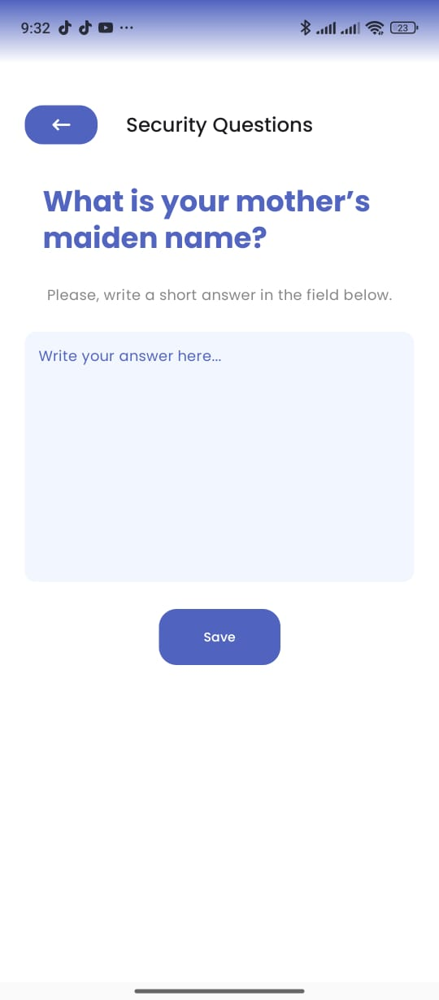 Security questions — step 2</td>
  </tr>
  <tr>
    <td align="center">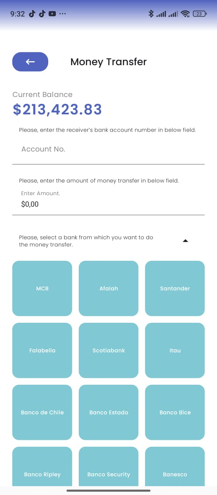 Transfer flow</td>
    <td></td>
    <td></td>
    <td></td>
  </tr>
</table>

---

Design reference (Figma): https://www.figma.com/design/LsEN9DoypcT6Kj08sZGPd4/Transferme-Banking-Financial-Full-APP-Ui-Template-Free-57-plus-screen--Community-?node-id=0-1&p=f&t=lJ92lqVhEzn2o5DK-0

This README was generated with AI.
